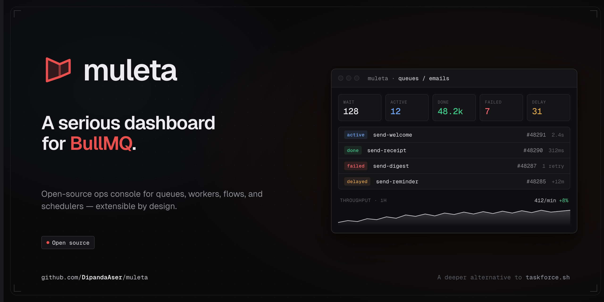

# muleta

Open-source operator dashboard for [BullMQ](https://docs.bullmq.io). Run it as its own process, or embed it in any Node app under your existing auth.



> Pre-1.0. The API and config surface may change between `0.x` minor releases. See the [roadmap](#status) below.

## Two ways to run it

### 1. Docker (standalone)

Fastest path. Runs as its own service, points at your existing Redis.

```bash
docker run --rm -p 3737:3737 \
  -e MULETA_REDIS_URL=redis://host.docker.internal:6379 \
  ghcr.io/muleta-dev/muleta:edge
```

Open <http://localhost:3737>. Multi-arch (`linux/amd64` + `linux/arm64`). Full guide: [docs/docker.md](docs/docker.md).

### 2. Embedded in your app

Mount the dashboard inside an existing Node app — same process, same auth, same deploy. The SPA is bundled inside the npm package; one install, one mount point.

```ts
import { createMuleta } from "@muleta-dev/core"
import { createEndpoints, createHandler } from "@muleta-dev/server"
import { Hono } from "hono"

const muleta = await createMuleta({ redis: { url: process.env.REDIS_URL! } })
const dashboard = createHandler({
  endpoints: createEndpoints(muleta),
  assets: "bundled",
  basePath: "/admin/queues",
})

const app = new Hono()
app.route("/admin/queues", dashboard)
```

Adapters available for Express, AdonisJS, NestJS, and raw `node:http`. Full guide: [docs/embed.md](docs/embed.md).

> **Heads-up:** muleta ships **without authentication** — the dashboard exposes destructive actions (retry, remove, pause). See [docs/auth.md](docs/auth.md) for the wrapping pattern before deploying.

## What's in the box

- **Queue list** with live counts (waiting / active / completed / failed / delayed / paused), pause/resume controls.
- **Job inspector** — data, options, logs, timeline, raw — plus retry / promote / remove / duplicate actions.
- **Workers + schedulers** views with cron pattern explanations and next-run previews.
- **Flows graph** with parent/child topology rendered via SvelteFlow.
- **Live updates** via SSE — no polling overhead, no manual refresh.

## Documentation

| Topic | Doc |
| --- | --- |
| Run muleta as a Docker container | [docs/docker.md](docs/docker.md) |
| Embed in your Node app (Hono / Express / Adonis / Nest / raw http) | [docs/embed.md](docs/embed.md) |
| Wrap the dashboard with your auth middleware | [docs/auth.md](docs/auth.md) |
| Report a security issue | [SECURITY.md](SECURITY.md) |

Runnable embed examples: [`examples/embed-hono`](examples/embed-hono), [`examples/embed-express`](examples/embed-express), [`examples/embed-node-http`](examples/embed-node-http).

## Packages

| Package | What it is |
| --- | --- |
| [`@muleta-dev/server`](packages/server) | Hono handler with the dashboard SPA bundled — what most people install. |
| [`@muleta-dev/core`](packages/core) | Headless queue accessors. Use directly only if you're building custom tooling on top of muleta's queue model. |
| `ghcr.io/muleta-dev/muleta` | Standalone Docker image — built from [`apps/standalone`](apps/standalone). |

## Status

**v0.1 milestone:** dashboard parity with bull-board for the read paths, plus the destructive operator actions, plus embeddable everywhere bull-board is.

Tracked publicly in [GitHub issues](https://github.com/DipandaAser/muleta/issues). Roadmap items being prioritized for `0.x`:

- Built-in viewer/admin role split + audit log of destructive actions
- Configurable BullMQ key prefix in standalone mode
- Optional bearer-token auth for the API surface
- Fastify embed adapter

Pre-1.0 means breaking changes are possible between minor releases; pin to a specific version (`@muleta-dev/server@0.x.y` or `:X.Y.Z` Docker tag) for production.

## Build from source

```bash
pnpm install
pnpm lint
pnpm typecheck
pnpm test
```

Node 22+ and pnpm 9+. The repo is a monorepo with packages, apps, and runnable examples wired through pnpm workspaces.

## License

[Apache License 2.0](LICENSE).
